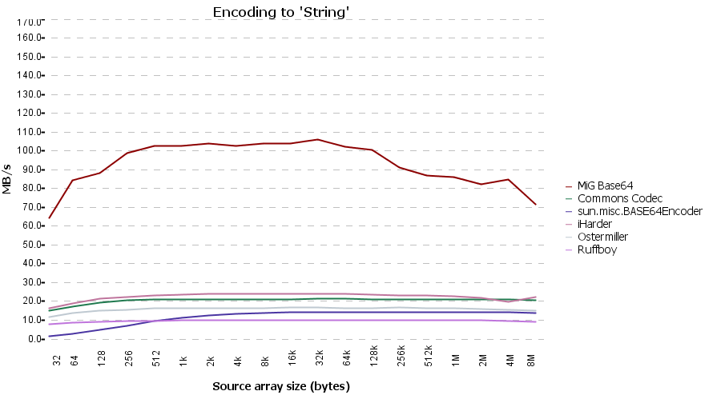
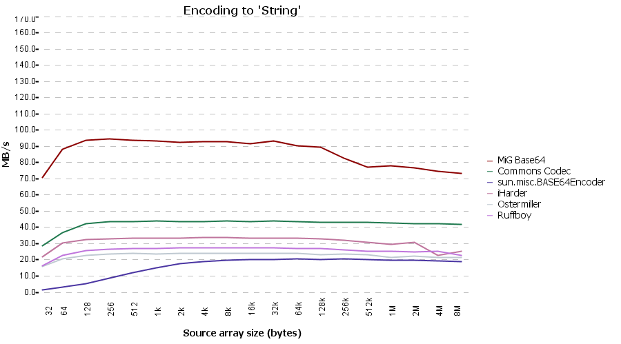

Overview
==

MiGBase64 is a very fast Base64 Codec written in Java. It is currently faster than any other Java codecs I know of and it doesn't create any temporary arrays which many others do.

Repository History
==
This library is clone of http://migbase64.sourceforge.net/ project. It has been cloned here in github for following reasons.

* To Manvanify the project
* To Sync the artifacts to Maven Central

Other than that, code/tests are exactly same as original repository and same BSD license applies here as well. 
Full copyright of this library belongs to Mikael Grev.

To include this library, add following dependency. You can also add this using m2e artifact search.

Maven:

	<dependency>
	    <groupId>com.brsanthu</groupId>
	    <artifactId>migbase64</artifactId>
	    <version>2.2</version>
	</dependency>

Gradle:

	compile("com.brsanthu:migbase64:2.2")

If you have any questions or issues about the functionality of the library, I would recommend you create an issue in sourceforce at http://sourceforge.net/p/migbase64/feature-requests/

However if the issue is related to artificat availability in Maven central, please create an issue here, in Github.

As groupId, I would have preferred to use migcomponents.com (due to http://www.migcomponents.com) but decided to use my own groupId brsanthu.com 
just so I can easily release artifacts into Maven Central using my existing account at https://oss.sonatype.org.

Performance
==
__from http://migbase64.sourceforge.net/__

Client VM
--

![Client VM - Encode char[]](client-encode-char.png "Client VM - Encode char[]")

![Client VM - Encode byte[]](client-encode-byte.png "Client VM - Encode char[]")

Server VM
--

![Server VM - Encode char[]](server-encode-char.png "Server VM - Encode char[]")

![Server VM - Encode byte[]](server-encode-byte.png "Server VM - Encode char[]")

Release Notes
==
__from https://sourceforge.net/p/migbase64/news/?source=navbar__

2.2 (2004-08-06)
--
* Added a "fast" decode method that is a little more than two times faster than the normal one but has some moderate restriction on input.

* Normal decode now handles negative bytes and just disregard them as specified in RFC 2045.

* Some minor enhancements

2.1 (2004-08-06)
--
The initial release has been posted.
Posted by  Mikael Grev 

Donate
==
[Donate at Sourceforge](https://sourceforge.net/p/migbase64/donate/)